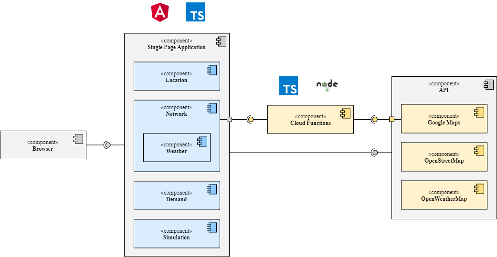

# STRADA
[](https://travis-ci.org/robisim74/STRADA)

> STRADA (_Simulation of TRAffic DAta_) is an urban traffic web simulator that uses data in real time built with Angular, TypeScript & Firebase.

> Project developed for the dissertation of my bachelor's degree in computer engineering.

## Documentation
Official docs: [STRADA documentation](https://robisim74.github.io/STRADA/)

## Motivation
A widespread cliché wants urban traffic to be created because roads and public transport are insufficient or not working. Indeed, those who participated in the design of complex systems know perfectly that overdimensioning beyond average demand often does not give the expected results, or is not economically sustainable or for other factors. Traffic is due to population density and human activities that are concentrated in the same place or time. Even the Romans or medieval cities had busy roads: a sign of vitality, productivity, the ability of some centers to attract people and activities. In fact, over time, various meanings have been attributed to traffic: from "trade" to "circulation", but only in the automobile age the effect of congestion has replaced its original meanings to become the common use.<br>
Although traffic is inevitable in some situations, it is possible to study it in order to reduce the effect of congestion - as well as traffic accidents and pollution.<br>
Software simulators allow you to analyze, design, plan and manage urban mobility in order to find the best solutions for the traffic problems before adopting them in reality.<br>
The STRADA simulator - _Simulation of TRAffic DAta_ - is a web application that can process any transport network, obtain traffic data in real time and offer a simulation of traffic flow, with the purpose of controlling, estimating or predict traffic considering different conditions, such as different weather conditions.

## Features
- Graph generation of any transport network on a real map
- Transport demand calculation without extensive statistical surveys or expensive traffic sensors
- Real time factors such as weather conditions
- A macroscopic simulation model (LTM - _Link Transmission Model_) in the context of urban traffic

## Architecture


## Demo
> The demo allows a limited number of daily simulations, because past the quota limits traffic data become paid.

[STRADA](https://strada-simulator.firebaseapp.com)

## Development

### Requirements
- [Node.js and npm](https://nodejs.org)
- Update npm: `npm install npm@latest -g`
- Angular CLI: `npm install -g @angular/cli`
- Firebase
    - Create a Firebase project in the [Firebase console](https://console.firebase.google.com/)
    - Firebase CLI: `npm install -g firebase-tools`
    - Login: `firebase login`
- Google Maps 
    - Get your API keys: https://cloud.google.com/maps-platform/
    - Enable _Maps JavaScript API_, _Geocoding API_ and _Directions API_
- OpenWeatherMap
    - Get your API key: https://openweathermap.org/

### Prerequisites
- Update `.firebaserc` file
- Update `src/app/app-config.json` file
- Update `functions/src/functions-config.json` file

### Firebase Functions
```Shell
cd functions
npm install
npm run serve:dev
```

### App
```Shell
npm install
npm start
```

## Test
```Shell
npm test
```

## License
MIT